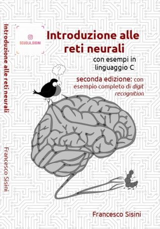

# Codici del Libro: *Introduzione alle reti neurali con esempi in linguaggio C*
In questo repository sono mantenuti i codici del libro che è disponibile su [amazon](https://www.amazon.it/Introduzione-alle-neurali-esempi-linguaggio/dp/1692945319)

Un estratto del libro è presentato nel [Estratto_libro.pdf](Estratto_libro.pdf)

Il libro propone un percorso continuo che dalla nozione di neurone e di rete di neuroni in biologia, 
arriva alla codifica di una rete neurale artificiale in informatica.
Dal confronto tra il funzionamento di un elaboratore elettronico e quello di un cervello biologico, 
si evidenziano differenze morfologiche, strutturali e architetturali, ma anche numerose affinità funzionali 
nell'ambito cognitivo.Il libro si apre con l'introduzione dei concetti che sono alla base dei modelli
di apprendimento che hanno ispirato lo sviluppo delle reti neurali artificiali: cellule nervose,
reti di neuroni e memoria associativa. La matematica necessaria a capire e sviluppare tali modelli è illustrata e
spiegata nella prima sezione del libro. 
Il linguaggio C e le basi di informatica necessarie per la programmazione di una rete neurale artificiale 
si trovano nella seconda sezione. Qui si presenta l'architettura di un eleboaratore elettronico e la sua origine 
dalla logica e dall'algebra. Si illustrano e spiegano i concetti di algoritmo e di programma mantenendo sempre una 
stretta relazione tra il linguaggio di programmazione e l'hardware sottostante.Nella terza sezione, 
tali modelli vengono analizzati in profondità e trasformati in procedure informatiche capaci di realizzare
delle funzionalità cognitive. Tra gli altri, viene sviluppato l'esempio completo di una rete neurale capace 
di riconoscere le cifre numeriche scritte a mano.

